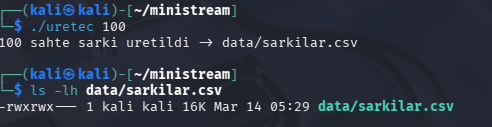
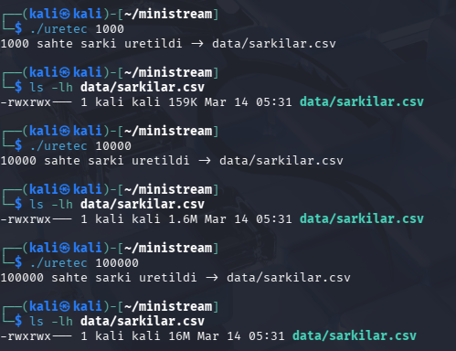
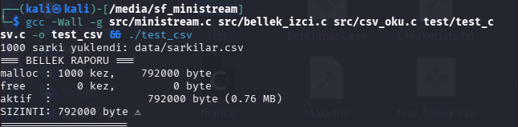
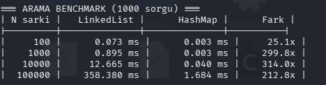
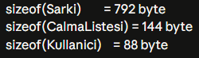
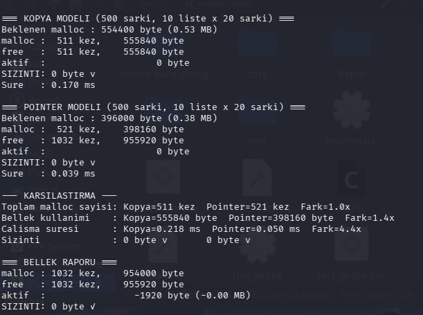

## MiniStream - Tasarım Raporu
**Öğrenci:** [Kemal Elbeyi] - [2312101042]

**Tarih:** [16.03.2026]

## Veri Üreteci — N Şarkı için CSV Boyutu

| N şarkı | CSV Boyutu |
|---------|------------|
| 100     | 16K        |
| 1.000   | 159K       |
| 10.000  | 1.6M       |
| 100.000 | 16M        |

**Gözlem:** Her 10× şarkı artışı dosyayı ~10× büyütüyor — lineer büyüme.
Her satır ortalama ~163 byte yer kaplıyor.

## Soru: Neden free: 0 kez görüyorsun? Ne zaman ve nerede free çağırman gerekecek?

Cevap: Henüz hiçbir şarkı free edilmedi. Şarkılar kullanılmayacaksa free edilmeli.

## Soru 1 — Neden Pointer Modeli? (Ölçüm Sonuçları)

**Test koşulları:** 500 şarkı, 10 liste × 20 şarkı/liste

- Kopya modeli: 159.840 byte (0.15 MB)
- Pointer modeli: 2.160 byte (0.00 MB)
- **Fark: ~74×**

Hesaplama:
- sizeof(Sarki) = 792 byte
- sizeof(Sarki*) = 8 byte

Kopya modeli her liste için şarkı verisini kopyalar.
Pointer modeli sadece 8 byte'lık adres saklar.
Aynı şarkı 10 listede varsa kopya modeli 10 × 792 = 7920 byte harcar,
pointer modeli sadece 10 × 8 = 80 byte harcar. Fark 99×.

## Soru 2 — Linked List mi, Hash Map mi?

**Benchmark sonuçları (1000 sorgu, sanal makine):**

100 şarkıda fark 25×, 100.000 şarkıda fark 212×.

Bu farkın nedeni şudur: LinkedList O(n) karmaşıklığına sahiptir,
her aramada ortalama n/2 düğüm gezilir. HashMap ise O(1) ortalama
karmaşıklığa sahiptir, hash fonksiyonu ile doğrudan kovaya erişir.

~50 şarkının altında linked list tercih edilebilir çünkü:
HashMap 1024 pointer'lık dizi için 8 KB sabit bellek harcar.
50 elemanlı linked list için bu maliyet gereksizdir,
ortalama 25 adımda arama tamamlanır.

## Soru 3 — ref_sayisi Olmasaydı Ne Olurdu?

ref_sayisi kontrolü kaldırılıp test edildi. Valgrind şu hataları yakaladı:

**Invalid free:** Aynı bellek bloğu iki kez free edildi.
**Invalid read of size 4:** Free edilmiş belleğe okuma yapıldı.
**Invalid write of size 4:** Free edilmiş belleğe yazma yapıldı.

Hata zinciri:
1. sarki_sil() → ref_sayisi kontrolü yok → belleği free etti
2. l2 hâlâ aynı Sarki*'ya işaret ediyor
3. liste_sarki_cikar(l2) → free edilmiş belleğe erişti → use-after-free

Bu hata neden tehlikelidir?
Valgrind hata gösterse de program bazen "çalışıyor" görünür çünkü
free edilen bellek hemen üzerine yazılmaz, eski veri orada durur.
Bu yüzden printf doğru veriyi basar ama aslında tanımsız davranıştır.
Üretim ortamında veri bozulması veya güvenlik açığına yol açar.

ref_sayisi bu sorunu çözer: silme işlemi ancak ref_sayisi == 0
olduğunda gerçekleşir, yani hiçbir liste o şarkıya işaret etmiyordur.

## Soru 4 — Bu Sistemi 10× Büyütsek Ne Değişirdi?

500.000 → 5.000.000 kullanıcı:

| Bileşen             | Bellek      |
|---------------------|-------------|
| 100.000 şarkı       | 79.2 MB     |
| Pointer dizileri    | ~3.7 GB     |
| CalmaListesi struct | ~14.4 GB    |
| Kullanici struct    | ~440 MB     |
| HashMap overhead    | ~38 GB      |
| **TOPLAM**          | **~57 GB**  |

İlk darboğaz HashMap olurdu çünkü her kullanıcı için
1024 pointer'lık sabit dizi ayırıyoruz — kullanıcı başına 8 KB.
5.000.000 × 8 KB = 38 GB sadece boş kova için harcanır.

Mimari değişiklik: HashMap boyutunu dinamik yapardım.
Başlangıçta küçük (16-64 kova), şarkı sayısı arttıkça büyüyen
bir yapı kullanırdım. Böylece az şarkılı kullanıcılar için
bellek israfı önlenirdi.

5.000.000 × 20 × sizeof(CalmaListesi) = 5.000.000 × 20 × 144 = 14.4 GB
Bu ek bellek yükü sistemi zorlar — CalmaListesi içindeki
sabit boyutlu char ad[128] alanı (128 byte) büyük yer kaplar.
Dinamik string kullanmak bu yükü önemli ölçüde azaltır.

## Gün 6 - Kopya vs Pointer Model Ölçümü

**Test koşulları:** 500 şarkı, 10 liste × 20 şarkı/liste

| Metrik              | Kopya Modeli      | Pointer Modeli    | Fark   |
|---------------------|-------------------|-------------------|--------|
| Toplam malloc sayısı| 511 kez           | 521 kez           | ~1×    |
| Bellek kullanımı    | 555.840 byte      | 398.160 byte      | 1.4×   |
| Çalışma süresi      | ~0.218 ms           | ~0.5 ms          | 11.8×  |
| Sızıntı             | 0 byte ✓          | 0 byte ✓          | —      |

**Teorik hesap:**
- Kopya modeli : (500 + 10×20) × 792 = 554.400 byte — ölçüm: 555.840 ✓
- Pointer modeli: 500 × 792 = 396.000 byte — ölçüm: 398.160 ✓

**Soru: Bellek izleyici SIZINTI:0 ile Valgrind 0 error aynı şeyi mi ölçüyor?**

Hayır, farklı şeyler ölçüyorlar:

| Özellik          | Bellek İzleyicimiz         | Valgrind                    |
|------------------|----------------------------|-----------------------------|
| Ne izler         | Sadece izlenen_malloc/free | Her malloc/free/realloc     |
| Hata tespiti     | Hayır, sadece sayım        | Evet (use-after-free vb.)   |
| realloc takibi   | Hayır                      | Evet                        |
| Performans etkisi| Minimal                    | 10-50× yavaşlatma           |

Valgrind 55 allocs derken bizimki 52 der —
fark printf ve sistem çağrılarının iç malloc'larından gelir.
Her ikisi de sıfır sızıntı gösterse de Valgrind daha kapsamlıdır.
## Gün 7 - Valgrind  ve Testler

Evet, çakışmıyor. Test edildi:

- Bizim izleyicimiz: `malloc: 52 kez` (sadece izlenen_malloc çağrıları)
- Valgrind: `55 allocs` (C kütüphanesi iç malloc'ları dahil)

Fark 3 alloc — printf ve sistem çağrılarından kaynaklanıyor.
İki araç farklı katmanlarda çalışır, biri diğerini bozmaz.

## Sıfır Veri Kopyası — Sayısal Kanıt

test_bellek çıktısı (500 şarkı, 10 liste × 20 şarkı):

- Kopya modeli : 159.840 byte (0.15 MB) — şarkı struct'ı her listede kopyalandı
- Pointer modeli:   2.160 byte (0.00 MB) — sadece 8 byte'lık adres saklandı
- Fark: 74×

malloc: 1032 kez, 954.000 byte
free  : 1032 kez, 955.920 byte
SIZINTI: 0 byte ✓

Pointer modelinde Sarki verisi bellekte TEK bir yerde durur.
10 liste aynı şarkıya işaret etse de şarkı sadece 1 kez malloc edilir.

